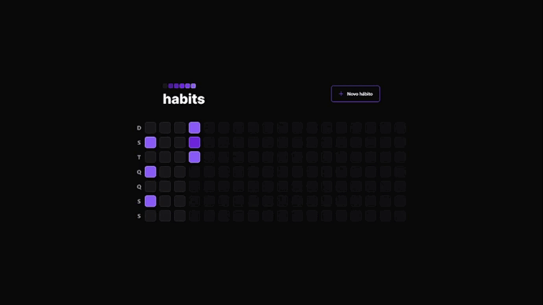
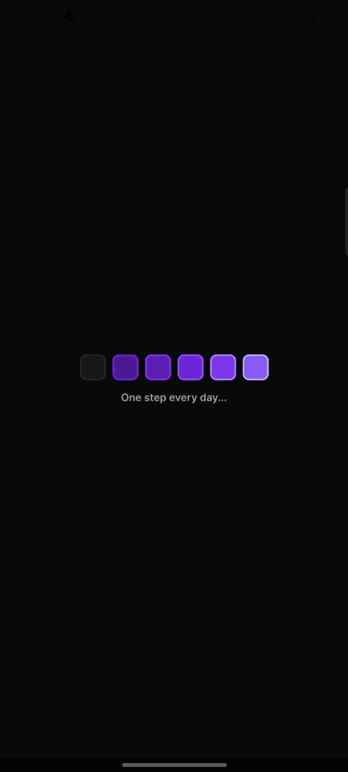

# NLW Setup - `Habits`
<div align="center">
    
</div>

# Sumário <br id="topo">
- [Introdução](#introducao)
- - [Informativo](#informativo)
- [Preview do projeto *Habits*](#preview)
- - [Web](#web)
- - [Mobile](#hmobile)
- [Ambientação](#ambientacao)
- [Tecnologias](#tecnologias)

# Introdução <a name="introducao"></a>

O `Habits` tracker, é uma ferramente de acompanhamento de hábitos para o usuário colocar em prática suas resoluções e metas, ou seja, registrar ações e acompanhar a evolução dos novos hábitos que deseja colocar na sua rotina.

Então o usuário poderá definir por exemplo alguns hábitos que fará em *todos os dias* da semana, ou somente em *dias específicos*. Podendo assim visualizar o progresso dos hábitos concluídos e não concluídos no decorrer dos dias.

## 🏷️ Informativo <a name="informativo"></a>

O projeto *Habits* foi desenvolvido durante o evento **NLW Setup** promovido pela <a href="https://www.rocketseat.com.br/">Rocketseat</a> nos dias 16 a 20 de janeiro de 2023, tendo o intuito de desenvolver uma aplicação Web e Mobile comunicando entre si com o banco de dados no acompanhamento e evolução de hábitos criados pelo usuário.

# 🗓️ Preview do projeto *Habits* <a name="preview"></a>

## 🖥️ Web <a name="web"></a>
<div align="center">
    
    <p>Visualizando hábitos em andamento e adicionando novo hábito.</p>
</div>

## 📱 Mobile <a name="mobile"></a>
<div align="center">
    
    <p>Visualizando hábitos em andamento e adicionando novo hábito.</p>
</div>

# ☕ Ambientação  <a name="ambientacao"></a>

A preparação do ambiente do projeto `Habits` é dividade em três pastas sendo elas:
> Após o clone deste repositório siga os procedimentos abaixo.

<details>
<summary><u>Clique aqui para abrir o 1º tutorial</u> <br>📂 server</summary>

1. Acesse a pasta server para executar os comandos e efetue a instalação das dependências no terminal da pasta digitando:
```console
npm install
```
2. Após a instalação das dependências é possível iniciar o servidor, digitando no terminal:
```console
npm run dev
```
3. Para visualizar o banco de dados atual, abra um segundo terminal acessando também a pasta server enquanto a aplicação do servidor continua rodando em outro terminal, digitando no segundo terminal:
> Nota: Para visualizar o banco de dados é necessário que o servidor continue rodando.
```console
npx prisma studio
```

</details>
<br>

<details>
<summary><u>Clique aqui para abrir o 2º tutorial</u> <br>📂 web</summary>

1. Acesse a pasta web para executar os comandos e efetue a instalação das dependências no terminal da pasta digitando:
```console
npm install
```
2. Após a instalação das dependências, é possível iniciar a aplicação Web digitando no terminal:
> Nota: Para visualizar a aplicação Web com os "dados" do banco de dados é necessário que um terminal ainda esteja rodando o servidor.
```console
npm run dev
```
3. Abra o navegador, a aplicação Web estará rodando em:
```console
http://localhost:5173/
```


</details>
<br>


<details>
<summary><u>Clique aqui para abrir o 3º tutorial</u> <br>📂 mobile</summary>

1. Acesse a pasta mobile para executar os comandos e efetue a instalação das dependências no terminal da pasta digitando:
```console
npm install
```
2. Após a instalação das dependências, é possível iniciar a aplicação Mobile digitando no terminal:
> Nota: Para visualizar a aplicação Mobile com os "dados" do banco de dados é necessário que um terminal ainda esteja rodando o servidor.
```console
npm start
```
> Note: Você deverá editar o arquivo .env.example renomeando para .env e alterar o conteúdo dele informando o ip onde o expo está rodando sua aplicação.

3. Caso você faça muitas alterações onde é necessário esvaziar o cache atual do build faça:
> Nota: Este comando irá esvaziar o cache atual, após isto você poderá executar as próximas vezes com `npm run start`.
```console
npm run clear
```

</details>
<br>

# 💻 Tecnologias <a name="tecnologias"></a> 

- [](https://reactjs.org/)

    Utilizado na aplicação Web, devido a facilidade na componentização.

- [](https://reactnative.dev/)

    Utilizado na aplicação Mobile, devido a facilidade na componentização e desenvolvimento híbrido.

- [](https://nodejs.org/en/)

    Utilizado no back-end das duas aplicações e próximo ao banco de dados. 

- [](https://www.typescriptlang.org/)

    Utilizado para se ter um melhor desenvolvimento nas duas aplicações evitando  possíveis erros devido a tipagem dos dados.

- [](https://expo.dev/)

    Utilizada na aplicação Mobile para gerenciar a aplicação, proporcionando uma facilidade na utilização de pacotes e configurações.

- [](https://www.typescriptlang.org/)

    Ferramenta principal de estilização nas duas aplicações, poupando tempo de desenvolvimento. 

- [](https://www.figma.com/)

    Layout utilizado <a href="https://www.figma.com/community/file/1195326661124171197">**Habits (i)** da Rocketseat.</a>

<hr>

[🔼 Voltar ao topo](#topo)